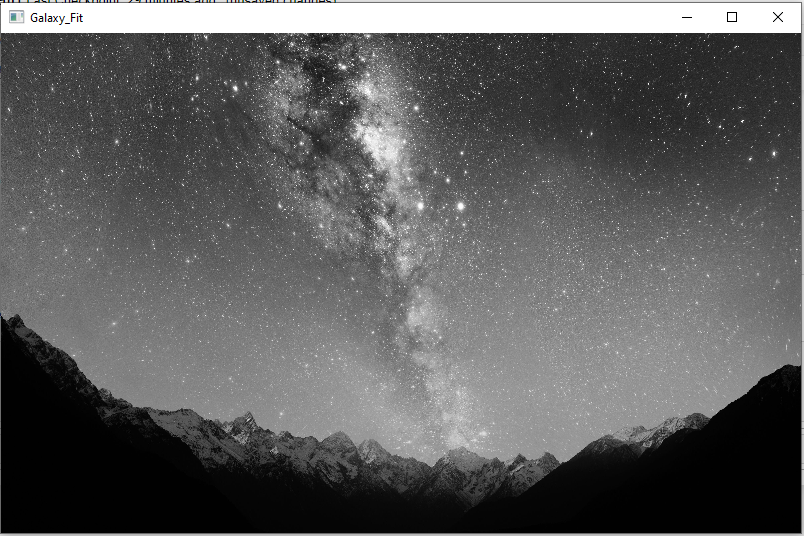

# <center> IMAGE PROCESSING WITH PYTHON <center>

### OpenCV: Stand for OPEN SOURCE COMPUTER VISION. Its can also be used in other programming languages.

##### Importing libraries


```python
import cv2
```

# Reading Image file :- Black N White Image


```python
img1 = cv2.imread('galaxy.jpg',0) # 1 : RGB ; 0 : B&W ; -1: transparency capability
```


```python
print(type(img1))  # So Image is basically array of pixels
```

    <class 'numpy.ndarray'>
    

###### Acctual Array/Image


```python
print(img1)  
```

    [[50 45 51 ... 40 44 45]
     [68 62 62 ... 37 42 44]
     [59 56 56 ... 38 43 46]
     ...
     [ 0  0  0 ...  1  1  1]
     [ 0  0  0 ...  1  1  1]
     [ 0  0  0 ...  1  1  1]]
    


```python
img1.shape
```


    (2250, 4000)


##### Shape of the array is 2250 rows and 4000 cols


```python
print(img1.ndim) # its a 2D array
```

    2
    

# Now, reading Image in RGB 


```python
img2 = cv2.imread("galaxy.jpg",1) 
```


```python
print(img2)
```

    [[[77 56 29]
      [72 51 24]
      [78 57 30]
      ...
      [70 46 16]
      [74 50 20]
      [75 51 21]]
    
     [[95 74 47]
      [89 68 41]
      [89 68 41]
      ...
      [67 43 13]
      [72 48 18]
      [74 50 20]]
    
     [[86 65 38]
      [83 62 35]
      [83 62 35]
      ...
      [68 44 14]
      [73 49 19]
      [76 52 22]]
    
     ...
    
     [[ 0  0  0]
      [ 0  0  0]
      [ 0  0  0]
      ...
      [ 1  1  1]
      [ 1  1  1]
      [ 1  1  1]]
    
     [[ 0  0  0]
      [ 0  0  0]
      [ 0  0  0]
      ...
      [ 1  1  1]
      [ 1  1  1]
      [ 1  1  1]]
    
     [[ 0  0  0]
      [ 0  0  0]
      [ 0  0  0]
      ...
      [ 1  1  1]
      [ 1  1  1]
      [ 1  1  1]]]
    

### TO SHOW THE IMAGE USE THIS COMMAND :


```python
cv2.imshow("Galaxy",img1)
cv2.waitKey(0)
cv2.destroyAllWindows()
```

##### The image is too big to be displayed on the screen to resize the image we use:


```python
resized_img = cv2.resize(img1,(800,500))
cv2.imshow("Galaxy_Fit",resized_img)
cv2.waitKey(0)
cv2.destroyAllWindows()
```



#### Now lets save the resized image into a new file


```python
cv2.imwrite("Resized_image.jpg",resized_img) # A new image file is created :D
```


    True


# END

# <center> PROJECT BY : @YASIRKHANA <center>


```python

```
